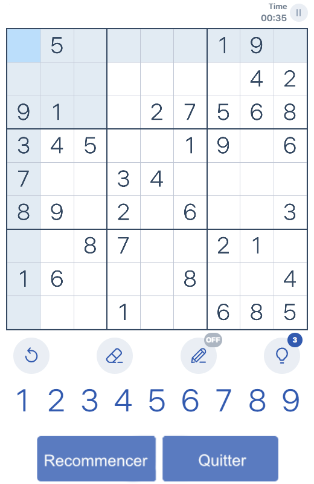
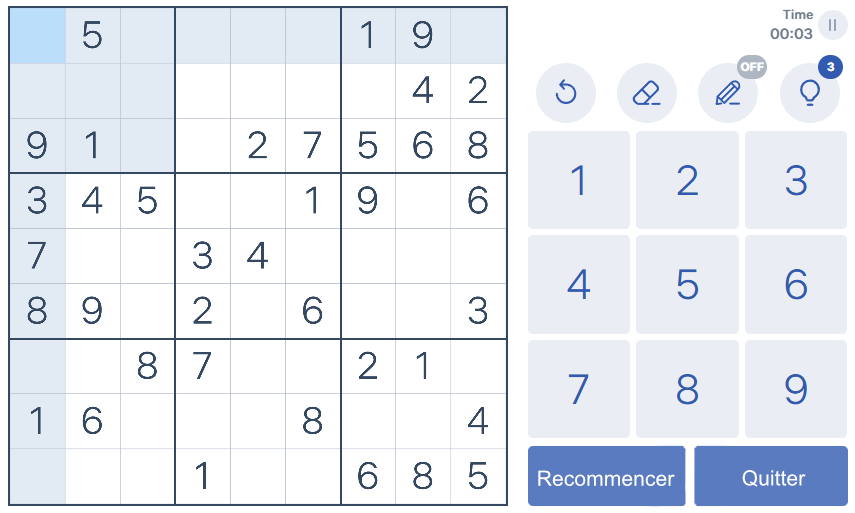

# 🎮 Sudoku Game

Un jeu de Sudoku moderne, **mobile-first**, développé avec React 19 et TypeScript.

🔗 **Démo en ligne** : [https://fzed51.github.io/sudoku-game/](https://fzed51.github.io/sudoku-game/)

---

## 📸 Captures d'écran

| Portrait | Paysage |
|:--------:|:-------:|
|  |  |

---

## ✨ Fonctionnalités

- **3 niveaux de difficulté** : Facile, Moyen, Difficile
- **Génération aléatoire** de grilles avec solution unique (backtracking)
- **Interface adaptative** portrait et paysage
- **Mode notes** : annoter les cases avec des chiffres candidats
- **Indices** : jusqu'à 3 indices par partie
- **Annulation** : retour en arrière illimité (undo)
- **Effacement** : supprimer la valeur ou les notes d'une case
- **Chronomètre** avec option pause
- **Compteur d'erreurs** avec pénalité de temps
- **Détection des conflits** en temps réel (ligne, colonne, bloc)
- **Meilleurs scores** par difficulté (global et hebdomadaire)
- **Navigation clavier** (flèches + chiffres)
- **Persistance de session** via `sessionStorage`
- **Service Worker** pour une utilisation hors ligne

---

## 🛠️ Stack technique

| Technologie | Version | Rôle |
|-------------|---------|------|
| [React](https://react.dev/) | 19 | UI avec React Compiler |
| [TypeScript](https://www.typescriptlang.org/) | ~6 | Typage strict |
| [Vite](https://vitejs.dev/) | 8 | Bundler & serveur de dev |
| [react-router-dom](https://reactrouter.com/) | 7 | Navigation SPA |
| CSS Modules | — | Styles scopés par composant |

---

## 📁 Structure du projet

```
src/
├── context/
│   └── SudokuContext.tsx   # État global (useReducer + dispatch)
├── utils/
│   ├── sudokuSolver.ts     # Algorithme de résolution (backtracking)
│   ├── sudokuGenerator.ts  # Génération de grilles aléatoires
│   └── scoreManager.ts     # Gestion des meilleurs scores
├── components/
│   ├── SudokuBoard.tsx     # Grille de jeu
│   ├── SudokuCell.tsx      # Cellule individuelle
│   ├── NumberPad.tsx       # Pavé numérique
│   ├── ToolBar.tsx         # Annuler / Effacer / Notes / Indice
│   ├── Timer.tsx           # Chronomètre
│   ├── GameActions.tsx     # Recommencer / Quitter
│   └── WinOverlay.tsx      # Écran de victoire
├── pages/
│   ├── HomePage.tsx        # Accueil : sélection de difficulté + scores
│   └── GamePage.tsx        # Page de jeu (portrait & paysage)
└── main.tsx                # Point d'entrée : BrowserRouter + SudokuProvider
```

---

## 🚀 Démarrage rapide

### Prérequis

- [Node.js](https://nodejs.org/) ≥ 18
- npm ≥ 9

### Installation

```bash
git clone https://github.com/fzed51/sudoku-game.git
cd sudoku-game
npm install
```

### Commandes

| Commande | Description |
|----------|-------------|
| `npm run dev` | Lance le serveur de développement (Vite) |
| `npm run build` | Vérification TypeScript + build de production |
| `npm run lint` | Analyse statique avec ESLint |
| `npm run preview` | Prévisualise le build de production |

---

## 🎯 Comment jouer

1. Sur la **page d'accueil**, choisissez un niveau de difficulté puis cliquez sur **Démarrer une partie**.
2. **Sélectionnez une cellule** vide en cliquant dessus.
3. **Entrez un chiffre** via le pavé numérique ou le clavier.
4. Utilisez la barre d'outils pour :
   - **↩ Annuler** — revenir au coup précédent
   - **✏ Effacer** — supprimer la valeur ou les notes de la cellule sélectionnée
   - **📝 Notes** — basculer en mode annotation (ON/OFF)
   - **💡 Indice** — révéler la valeur correcte d'une cellule (3 disponibles)
5. Complétez la grille sans erreur pour remporter la partie !

### ⌨️ Raccourcis clavier

| Touche | Action |
|--------|--------|
| `1` – `9` | Saisir un chiffre dans la cellule sélectionnée |
| `←` `↑` `→` `↓` | Déplacer la sélection |
| `Backspace` / `Delete` | Effacer la cellule sélectionnée |
| Bouton retour du navigateur | Annuler le dernier coup (en jeu) |

---

## 🧩 Niveaux de difficulté

| Niveau | Cellules retirées | Cases vides |
|--------|:-----------------:|:-----------:|
| Facile | 30 | ~37 % |
| Moyen | 43 | ~53 % |
| Difficile | 52 | ~64 % |

Toutes les grilles générées possèdent **une solution unique**, garantie par l'algorithme de comptage de solutions.

---

## 🏗️ Architecture

L'état complet de la partie est centralisé dans **`SudokuContext`** via `useReducer`. Les composants accèdent à l'état et aux actions via le hook `useSudoku()` — aucune prop drilling.

```
Board = (number | null)[][]   // null = cellule vide
given: boolean[][]            // cellules de départ (non modifiables)
Notes = Set<number>[][]       // notes candidates par cellule
```

Les algorithmes de génération et de résolution sont isolés dans `src/utils/` et ne sont jamais importés directement dans les composants : tout passe par le contexte.

---

## 📄 Licence

Ce projet est distribué sous licence [MIT](LICENSE).
